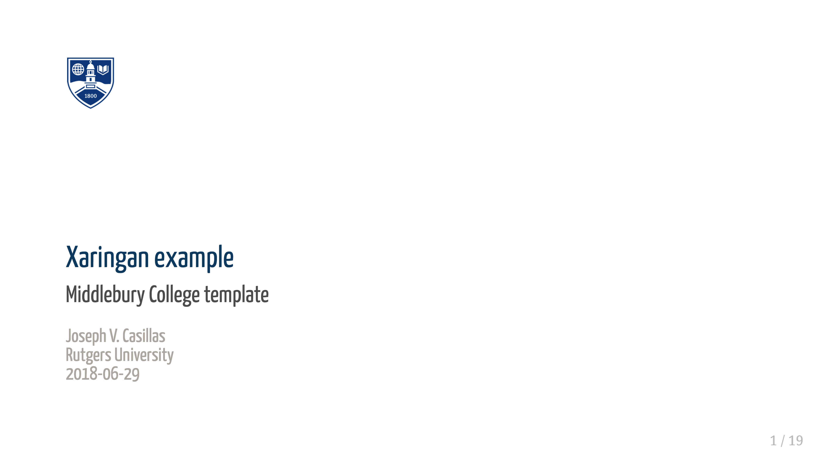

# midd_xaringan

Minimalist xaringan theme for html presentations using Middlebury style/colors

## Examples



Example presentation [here](https://www.jvcasillas.com/midd_xaringan/slides/index.html). 

## Usage

The Middlebury theme ~~is now~~ will hopefully soon be part of `xaringan`. You ~~can~~ 
will probably be able to use it by downloading the latest version of `xaringan` and adding `middlebury` 
and `middlebury-fonts` to the `css` call in the yaml front matter: 


```
---
title: "Title here"
subtitle: "Sub-title here"
author: "Your Name"
date: "Middlebury College </br> `r Sys.Date()`"
output:
  xaringan::moon_reader:
    lib_dir: libs
    css: ["middlebury", "middlebury-fonts"]
    nature:
      beforeInit: "https://www.jvcasillas.com/midd_xaringan/js/midd_xaringan.js"
      highlightStyle: github
      highlightLines: true
      countIncrementalSlides: false
      ratio: "16:9"
---
```
